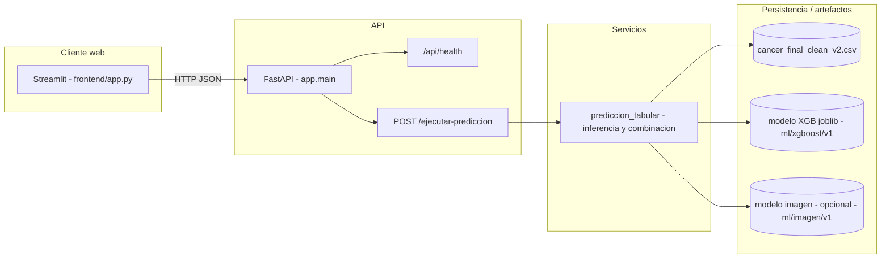

# Proyecto 2 — Simulador de apoyo al diagnóstico (cáncer de colon)

**Versión del documento:** 1.0 (alineada al código de la raíz del repositorio)  
**Propósito:** requisitos, casos de uso, arquitectura, experiencia de usuario, especificación técnica, pipeline y referencia a la evaluación, para cierre de entrega académica.

---

## 1. Resumen y alcance

Se ha desarrollado un **simulador** (no un producto clínico certificado) que integra:

- **Entrada:** historial y cuestionario ficticio (variables vitales, antecedentes, hábitos y síntomas) derivados del cuestionario procesado en `data/processed/`, y opcionalmente **imágenes** (flujo de carga en el cliente; la inferencia de imagen en el servidor queda parcialmente integrada según artefactos disponibles).
- **Salida:** probabilidad de la rama **tabular** (modelo de clasificación entrenado con el histórico del dataset), una **probabilidad combinada** cuando haya módulo de visión con probabilidad disponible, e información de **estado** sobre el resultado de la rama de imagen.

> **Aviso:** la herramienta **no sustituye** el juicio clínico; sirve para **formación, demostración y análisis de riesgo asistido por modelos** sobre datos estructurados (y, en el futuro, imágenes endoscópicas) según se documenta en el dataset y en los informes bajo `ml/`.

---

## 2. Requisitos funcionales (RF)

| ID | Requisito |
|----|------------|
| **RF-01** | El usuario puede recorrer un asistente en **varios pasos** (datos clínicos → carga de imágenes → revisión → resultado). |
| **RF-02** | El sistema carga y muestra **metadatos y rangos** del dataset procesado para orientar la introducción de valores. |
| **RF-03** | El usuario introduce **valores numéricos** (ordinales/binarios codificados) coherentes con `cancer_final_clean_v2.csv`. |
| **RF-04** | El usuario puede **adjuntar imágenes** (validación básica en cliente: tamaño, formatos) antes de la predicción. |
| **RF-05** | El sistema envía los datos al **backend** y obtiene: `probabilidad_tabular`, `probabilidad_combinada`, y `resultado_imagen` (estado, mensaje, probabilidad opcional). |
| **RF-06** | La interfaz **interpreta** el resultado (p. ej. riesgo alto/bajo a partir de un umbral de 0,5 sobre la probabilidad mostrada) y muestra el desglose tabular e imagen. |
| **RF-07** | Existe comprobación de **salud del servicio** (`GET /api/health`) para operación y orquestación. |

*Limitación actual documentada en código:* si el modelo de imagen no está disponible o no aporta `probabilidad`, la rama tabular rige; la **combinación ponderada** (0,6 tabular + 0,4 imagen) solo aplica cuando el servicio de imagen expone una probabilidad numérica (véase `backend/app/services/prediccion_tabular.py`).

---

## 3. Requisitos no funcionales (RNF)

| ID | Requisito |
|----|------------|
| **RNF-01** | **Rendimiento:** el API responde en un tiempo razonable en máquina local; inferencia tabular con `XGBoost` y fila única. |
| **RNF-02** | **CORS** configurable para orígenes de desarrollo (p. ej. `localhost:8501` para Streamlit). |
| **RNF-03** | **Mantenibilidad:** código en Python 3.11+ con separación `backend/` (API) y `frontend/` (Streamlit), más `ml/` y `data/scripts/`. |
| **RNF-04** | **Trazabilidad de datos:** el pipeline desde bruto a `cancer_final_clean_v2.csv` y manifiestos de imagen está descrito en `data/resumen_diagnostico_*.md` y scripts en `data/scripts/`. |
| **RNF-05** | **Ética y transparencia:** se debe entender qué hace el modelo; la documentación y comentarios en el código aluden a limitaciones (dataset ficticio, posible desbalance, no uso clínico directo). |
| **RNF-06** | **Reproducibilidad:** `pyproject.toml` fija dependencias principales; entrenamientos dejan `config.json` y métricas bajo `ml/`. |

---

## 4. Actores

| Actor | Descripción |
|--------|-------------|
| **Profesional o usuario de demostración** | Introduce un caso, revisa resultado y posibles mensajes de la rama de imagen. |
| **Sistema (API + modelos)** | Carga el modelo tabular, construye la fila de predicción, combina con imagen si aplica, devuelve JSON. |

---

## 5. Casos de uso (visión resumida)

### CU-01 — Introducir caso clínico y obtener riesgo tabular

- **Actor:** Usuario.  
- **Precondición:** API en ejecución, dataset procesado y artefacto tabular o capacidad de entrenar al vuelo en almacenamiento local.  
- **Flujo principal:** 1) Abrir simulador Streamlit. 2) Completar formulario. 3) (Opcional) Cargar imágenes. 4) Revisar y confirmar. 5) Llamar a `POST /ejecutar-prediccion`. 6) Leer probabilidades e interpretación en pantalla.  
- **Postcondición:** Resultados visibles y guardados en estado de sesión (Streamlit).

### CU-02 — Verificar que el servicio está vivo

- **Actor:** Desarrollador u operación.  
- **Flujo:** `GET /api/health` → `{"status":"ok"}`.

### CU-03 — Manejo de imágenes sin inferencia de servidor completa

- **Actor:** Usuario.  
- **Flujo alternativo:** Si el modelo de imagen no está en la ruta esperada o aún no integra preprocesado, el **mensaje** de `resultado_imagen` lo indica; el caso sigue siendo válido con riesgo **solo tabular**.

---

## 6. Escenarios de aceptación (criterio de negocio)

| Escenario | Entrada mínima | Resultado esperado (comportamiento) |
|-----------|----------------|--------------------------------------|
| **A — Solo tabular** | `num_imagenes_adjuntas = 0` | `probabilidad_combinada = probabilidad_tabular`; imagen: estado `sin_imagen` o lógica equivalente documentada. |
| **B — Con imágenes sin modelo** | N > 0 y sin artefacto de imagen | `resultado_imagen` informa `modelo_no_disponible`; riesgo igual al tabular. |
| **C — Datos inválidos** | Valores no numéricos en cuerpo | API responde **422** con mensaje claro. |
| **D — Dataset ausente** | (despliegue erróneo) | API **503** si falta el CSV, según manejo en ruta. |

*Los escenarios automatizados recomendados se describen en el apartado 12.*

---

## 7. Arquitectura lógica

A alto nivel, el simulador sigue un patrón **cliente (Streamlit) → API REST (FastAPI) → servicio de predicción → modelos y datos en disco**.

- **Origen de verdad** del contrato: `backend/app/schemas/prediccion.py` (entrada/salida) y `backend/app/services/prediccion_tabular.py` (lógica).

---

## 8. Diseño de UI/UX (Streamlit)

- **Paradigma:** asistente por **pasos** con barra de progreso (`frontend/layout.py`, `PASOS` en `frontend/config.py`).  
- **Formulario clínico:** etiquetas en español (`NOMBRES_VISUALES_VARIABLES`, `ETIQUETAS_POR_COLUMNA`) y controles alineados con las columnas del dataset.  
- **Feedback:** resultados y niveles de riesgo con texto claro; mensajes de error de conexión al API (`servicio_api.py`).  
- **Accesibilidad:** amplitud de página `wide` para formularios anchos; coherencia de títulos y pasos.  
*Mejora posible (fuera de este documento):* modos de alto contraste, textos de ayuda por variable clínica, y i18n para un manual en inglés.

---

## 9. Especificación técnica resumida

| Aspecto | Detalle |
|--------|--------|
| **Lenguaje** | Python ≥ 3,11 (véase `pyproject.toml`) |
| **API** | FastAPI + Uvicorn. Prefijo de salud: `/api/health`. Predicción: `POST /ejecutar-prediccion` (sin prefijo común, raíz de la app). |
| **Cliente** | Streamlit; variable de entorno `SIMULATOR_API_BASE_URL` (por defecto `http://127.0.0.1:8000`). |
| **Modelo tabular** | `XGBClassifier` o pipeline `joblib` bajo `ml/xgboost/v1/artefactos/`. Features derivadas: `n_sintomas`, `riesgo_familiar_x_edad` (misma lógica que en entrenamiento). |
| **Variable objetivo** | `cancer_diagnosis` (0/1). |
| **CORS** | `CORS_ORIGINS` o lista por defecto incl. puerto 8501. |
| **Documentación interactiva API** | `http://127.0.0.1:8000/docs` (OpenAPI) al levantar el backend. |

### Arranque (referencia)

- **Backend:** `uv run uvicorn app.main:app --reload --app-dir backend` (según comentario en `main.py` de la raíz).  
- **Simulador:** `uv run streamlit run frontend/app.py`.

---

## 10. Pipeline de datos (referencia repositorio)

- **Clínico:** Excel y limpieza → `data/processed/cancer_final_clean_v2.csv`; EDA y decisiones en `data/scripts/analysis/`, resumen en `data/resumen_diagnostico_clinico.md`.  
- **Imagen:** CVC + Kvasir, manifiestos y particiones; detalle en `data/resumen_diagnostico_imagen.md` y módulos `data/scripts/preparation/`, `dl/vision_baseline*`, `dl/vision_baseline_kvasir/`.  
- **Entrenamiento / comparación (laboratorio):** `ml/main.py` (Streamlit) para entrenar y evaluar modelos clásicos; artefactos en subcarpetas bajo `ml/`.

---

## 11. Evaluación, precisión y “fiabilidad”

- **Métricas** por modelo y run: ficheros `metricas_test.json`, `metricas_validacion.json`, historiales, en rutas bajo `ml/`.  
- **Interpretación:** la “fiabilidad” en la interfaz se comunica vía **probabilidad** y reglas de etiqueta (umbral 0,5) y mensajes; no constituye un **intervalo de confianza calibrado clínicamente**.  
- **Limitaciones del dataset:** sesgos posibles, datos no representativos de toda la población, y riesgo de **sobreajuste** o correlaciones espurias; el análisis de correlaciones y decisiones de features aparece en `data/resumen_diagnostico_clinico.md` y en la experimentación en `ml/`.

---

## 12. Pruebas y evidencias (estado y mínimo recomendado)

**Estado al redactar este documento:** el repositorio prioriza el código y los análisis de ML; la **batería automatizada** (pytest) es el siguiente paso lógico para requisitos M3RA3–M3RA4.

**Pruebas mínimas (implementadas en el repositorio):** carpeta `tests/`, con `httpx` y `pytest` en el extra opcional `dev` del `pyproject.toml`. Instalación: `uv sync --extra dev`. Ejecución: `uv run pytest -q`.

1. **Contrato (API):** `GET /api/health` → 200 y `{"status":"ok"}`.  
2. **Integración:** `POST /ejecutar-prediccion` con `datos_clinicos` tomados de la **primera fila** de `data/processed/cancer_final_clean_v2.csv` (el test se **omite** si el CSV no está en el entorno) y `num_imagenes_adjuntas: 0`; comprobación de probabilidades en `[0,1]` y esquema de `resultado_imagen`.  
3. **Validación negativa:** `datos_clinicos` con un valor no convertible a `float` → 422.  

4. *(Opcional)* **Aceptación:** guion manual o script de Playwright/Streamlit si la asignatura lo pide; suele aportar capturas o vídeo (véase enunciado).

La salida de `uv run pytest -q` o informe de CI puede anexarse como **evidencia** junto a este documento.

---

## 13. Trazabilidad con rúbricas (M3RA)

| RA | Cómo lo cubre esta entrega / el repo |
|----|--------------------------------------|
| **M3RA1** | Especificación técnica, UI/UX (§8–9) y requisitos funcionales. |
| **M3RA2** | Arquitectura (§7), código y comentarios en módulos principales, repositorio estructurado. |
| **M3RA3** | Pipeline (§10), sección de pruebas (§12), análisis de precisión (§11). |
| **M3RA4** | RF/RNF, casos de uso, documentación reutilizable; vídeo y manual en inglés son entregables **independientes** a este Markdown (no sustituyen los citados en el P2). |

---

## 14. Documentos y rutas relacionadas

| Ruta / recurso | Uso |
|----------------|-----|
| `P2 Enunciado Alumnos.pdf` (raíz) | Criterio oficial de entregables. |
| `.cursor/rules/proyecto-p2-enunciado.mdc` | Complemento de reglas de idioma y alcance. |
| `data/resumen_diagnostico_clinico.md` | Diccionario lógico y EDA clínico. |
| `data/resumen_diagnostico_imagen.md` | Fuentes y manifiestos de imagen. |
| `ml/README.md` | Uso de `ml/main.py` y particiones. |
| `dl/vision_baseline/README.md` / `dl/vision_baseline_kvasir/README.md` / `ml/readme_ml_clinico.md` | Visión (PyTorch: binario y Kvasir) y ML tabular / Streamlit. |

---

*Fin del documento de entrega unificado.*
